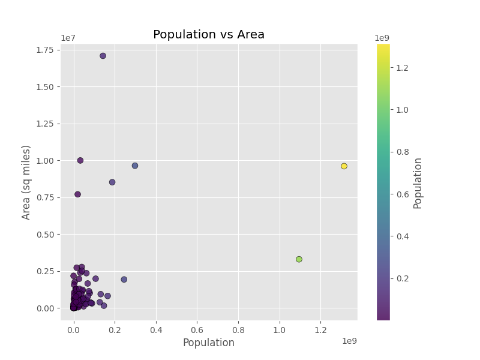

# Global Metrics Visualized

## Project Members:
- Niharika Kompally
- Srikar Bokka
- Kathyayini Paruchuri

## Project Goal:
The **Global Metrics Visualized** project aims is to explore and visualize country-level data using Python libraries like Pandas, Matplotlib, and Seaborn. Through histograms, scatter plots, and pair plots, we aim to identify patterns and relationships among variables such as Birthrate, Literacy Rate, Population, Area, GDP, Deathrate, and Infant Mortality.

## Features:
**Histogram Visualization:**

Created a histogram to show the distribution of Birthrate across countries, distribution of Literacy Rate, and identified the tallest bar's value range.

**Scatter Plot Visualization:**

Plotted a Population vs Area scatter plot, with color intensity representing population size (using a color map for better readability).

**Pairwise Scatter Plots:**

Built a pairplot between Birthrate, Deathrate, Infant Mortality, and GDP, separated by Region, to uncover correlations between variables.

**Visual Enhancements:**

Applied ggplot style for consistent and clean visuals.

Added colorbars, color mapping, gridlines, and labeled axes for better interpretation of plots.

**Library Stack:**

Used Pandas for data handling, Matplotlib for standard plotting, and Seaborn for advanced statistical visualization.

## Insights:
**Birthrate Distribution:**

Most countries have moderate birthrates, extreme low or high birthrates are less common.

**Literacy Rate Distribution:**

The tallest bar in the Literacy Rate histogram falls between 91.76% and 100%, showing that a majority of countries have very high literacy rates.

**Population vs Area:**

No strong correlation between country area size and population.

Some countries have large land areas but small populations (indicating sparsely populated regions).

Color mapping helped visualize how population density varies visually across countries.

Birthrate, Deathrate, Infant Mortality, and GDP Relationships:

Higher GDP is strongly associated with lower Infant Mortality rates (negative correlation).

Birthrate and Infant Mortality show a positive correlation — higher birthrates often accompany higher infant mortality rates.

GDP and Birthrate have a mild negative correlation, suggesting that wealthier countries tend to have lower birthrates.

**Regional Differences:**

Different regions show visibly different clustering patterns in the pairplot, indicating regional economic and social differences.

## Prerequisites:
Before running the scripts, ensure you have the following installed:
1. **Matplotlib**  
Comprehensive library for creating static, animated, and interactive visualizations in Python.

```
pip install matplotlib
```

2. **Pandas**  
Organizes data into tables (data frames) for easy filtering.

```
pip install pandas
```

3. **Seaborn**  
Python data visualization library based on matplotlib.

```
pip install seaborn
```

## Getting Started:
1. Clone this repository using git:  
```
git clone https://github.com/niharika-k29/global-metrics-visualized
```

or download the code as a ZIP file
```
https://github.com/niharika-k29/global-metrics-visualized/archive/refs/heads/main.zip
```

2. Navigate to your project directory and run the desired scripts using:

```
cd <project_path>
python <filename.py>
```

### Example:
```
python MCIS-6333_project_niharika.kompally_P1.py
python MCIS-6333_project_niharika.kompally_P2.py
```

## Sample Visualizations:
### Distribution of Birth Rate:

### Distribution of Literacy Rate:

### Scatter Plot: Population vs Area

### 16 Scatter Plots for Birthrate, Deathrate, Infant mortality, and GDP
